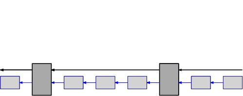

# Hcashd

Blockchain technique has been thoroughly supported by researchers in both fields of distributed system and cryptography, regarding its delicate consensus model, scalability, efficiency, security, robustness, as well as privacy properties.
After the testimony of the market over eight years, blockchain has been considered as a dependable technique of public awareness. 

Apart from the blockchain, DAG technique has also been leveraged in few existing cryptocurrencies, merited for its overwhelming throughput, rapid transaction confirmation (especially in case of massive participation), by replacing the blockchain with a directed acyclic graph of transactions.
However, DAG-based public-chain systems have been well supported by neither a rigid and convincing theoretical analysis nor a sophisticated trial of the market. Moreover, problematic issues exist in DAG-based cryptocurrencies, like IOTA's security properties' high dependence on the transaction frequency, and Byteball's dependence on few ''witness'' nodes which leads to a potential centralization.
To avoid risks of DAG-based techniques, we adopt blockchain as the basis of our Hcash's underlying consensus scheme.

In 2008, for the first time in history, a fully decentralized monetary network based on a novel technique known as the blockchain was proposed by Satoshi Nakamoto in his documentation description of bitcoin.
After bitcoin's proposal, various decentralized cryptocurrencies have been theoretically proposed or developed. Also, massive enhancements to the blockchain have been devised and put into practice of existing cryptocurrencies.
Some of the most attractive innovations include Ethereum (by supporting smart contracts with the extension of the underlying script),
CryptoNotes, ZeroCash (by enhancing privacy via ring signatures or non-interactive zero-knowledge proofs), DASH, Decred (by a hybrid consensus and the implementation of a basic DAO), IOTA, Byteball (by improving the throughput with a DAG structure), Bitcoin-NG (by an novel primitive of a blockchain of two levels), and ''sidechain'' techniques (providing a linkability among different cryptocurrencies).

Cryptocurrencies implementing the proof-of-work (PoW), which is the foundation of bitcoin's consensus scheme, have been merited for many advantages, including a trustworthy sustainability (after sustaining sufficient practical trials), strong robustness against certain malicious participants, delicate incentive-compatibility, and a support of participants' dynamical joining and leaving.
On the other hand, PoW has also been indifferent due to its waste of resources and a potential centralization of hash power.
Therefore, alternative consensus primitives have been introduced to replace (fully or partially) PoW, like proof-of-stake (PoS).
However, pure PoS (a total substitution from PoW to PoS) is also controversial for its sustainability, due to its lack of practical trials and the risk of time-stamp forgery.

Another disadvantage of bitcoin is its limited throughput of transactions. Specifically, merely 7 transactions can be tackled by the existing network per second. That is, approximately only 600 thousand transactions can be tackled every day. This is a notorious drawback of bitcoin's future participation. Current improvement to this include:

1.  shortening the block interval;
2.  extending the block size;
3.  a chain structure of multiple levels;
4.  introducing ''the lightning network'';
5.  a ledger of a DAG framework.

Within them:

1. compromises a certain stability, which has been proven by ETH's short block interval (20s to 30s). To face this issue, a controversial protocol called ''GHOST'' has to be introduced to ETH.
2. causes a great communication burden to the network.
3. is utilized in Bitcoin-NG, its main principle is: the block proposed by miners after solving a hash puzzle is called a ''keyblock''. After the proposal of a keyblock, the proposer can release few ''microblock''s, before other miner's proposal of another keyblock. However, Bitcoin-NG is also problematic for its vulnerability facing a selfish mining and a potential attack by keyblock proposer's spawning massive microblocks, in which case the convergence property is undermined by chain forks, and the network is overloaded. 
4. provides efficiency, targeting at transactions with small value and high frequency.
5. extends the throughput significantly, while not well supported by a convincing theoretical proof or a long-term practice. Also, certain security risks exist in 5).

To date, pure PoW (without a hybrid of other consensus primitives like PoS) and a hybrid of PoW and PoS (like DASH and Decred) are still mainstreams of existing cryptocurrencies. However, the efficiency and throughput are limited in these mechanisms. 
Hcash aims at a secure, efficient, robust and hence dependable public chain cryptocurrency. Moreover, new characters will be released step by step by us including post-quantum techniques, smart contracts, a strong protection of wallets, and a linkability among blockchain based and DAG based distributed ledgers, etc.
To achieve this, two major characteristics are provided ahead in this release of Hcash:

1. With an alternative double-chain framework of the blockchain (differs from that of Bitcoin-NG), significant improvement of the efficiency is offered without compromising the security.
2. With a hybrid consensus, miners and stakeholders are incentivized to take part in the consensus, thereby enhancing the security and flexibility, and providing a mechanism that supports DAO for future protocol updating and project investments.

Adopting merits of both Decred and Bitcoin-NG, we devise a brand new consensus mechanism consisting of their key methodologies and our newly proposed innovations.
Firstly, with the methodology from Bitcoin-NG's keyblock/microblock structure, we offer a novel chain structure consisting two levels of blocks. In this way, the aforementioned hazard concerning the convergence property is faced. Specifically, the difficulty of the PoW hash puzzle is replaced by two difficulties. During miner's solving a hash puzzle, a keyblock can be proposed once a harder difficulty is met, and a microblock in case of a lower difficulty. In this way, the malicious power has to solve enough puzzles to spawn microblocks, hence the throughput and efficiency is enhanced without a compromise of security or robustness.
Moreover, to face the selfish mining, strengthen the robustness (against ''the 51\% attack''), and offer the flexibility (supporting both PoW and PoS mining), we adopt Decred's mechanism of voting tickets (a practical and flexible PoS scheme).
With the combination of two innovations above, a novel hybrid consensus scheme is formed, where keyblocks should be confirmed by certain voting tickets and both PoW and PoS miners participate in the consensus and play an important role.
Based on such a hybrid scheme, we implement a DAO that offers PoW and PoS miners' future decisions concerning protocol updating and project investments.
Meanwhile, our scheme supports ''the segregated witness'', which facilitates future post-quantum signature schemes and the lightning network.
The framework of our newly devised blockchain structure is shown in the figure below. 

	
	 
	Figure 1: The blockchain structure in our scheme
	 

          

In the following table, comparisons are made between Hcash and few other existing distributed ledgers, including throughputs of Hcash with different intervals of block generations. The current release corresponds to the line marked with the bold font.

|             |Keyblock Average Interval|Block Size|Microblock Average Interval|Transaction Size|Throughput      |
|:----------- |:-----------------------:|:--------:|:-------------------------:|:--------------:|:--------------:|
|BTC          | 10min                   | 1MB      |                           | 250B           | 6.99TPS        |
|BTC(extended)| 10min                   | 2MB      |                           | 250B           | 13.98TPS       |
|BCC          | 10min                   | 8MB      |                           | 250B           | 55.92TPS       |
|Decred       | 5min                    |1.25MB    |                           | 250B           | 17.48TPS       |
|__Hcash__    | __5min__                | __2MB__  |    __18.75 sec__          | __250B__       | __447.39TPS__  |
|Hcash        | 5min                    | 8MB      |      18.75 sec            | 250B           | 1789.57TPS     |

The following table offers an approximated chance of adversary's successfully undermining the system (in case of different PoW power and PoS capabilities).

;--------------------------------------

|票池比例|0.05|0.1|0.15|0.2|0.25|0.3|0.35|0.4|0.45|0.5|
|:--|:--|:--|:--|:--|:--|:--|:--|:--|:--|:--|
|算力比例|||||||||||
|0.05|0.0001|0.0005|0.0014|0.0032|0.006|0.0102|0.0159|0.0239|0.0348|0.05|
|0.1|0.0001|0.001|0.003|0.0068|0.0127|0.0212|0.033|0.0491|0.0708|0.1|
|0.15|0.0002|0.0015|0.0048|0.0107|0.02|0.0332|0.0515|0.0758|0.108|0.15|
|0.2|0.0003|0.0022|0.0068|0.0151|0.0281|0.0465|0.0714|0.1042|0.1464|0.2|
|0.25|0.0004|0.0029|0.009|0.0201|0.0371|0.061|0.093|0.1342|0.1861|0.25|
|0.3|0.0005|0.0037|0.0116|0.0257|0.0472|0.0771|0.1164|0.1662|0.2272|0.3|
|0.35|0.0006|0.0046|0.0145|0.032|0.0585|0.095|0.142|0.2003|0.2697|0.35|
|0.4|0.0008|0.0057|0.0179|0.0394|0.0715|0.115|0.1701|0.2367|0.3138|0.4|
|0.45|0.0009|0.007|0.0219|0.0479|0.0863|0.1375|0.201|0.2756|0.3595|0.45|
|0.5|0.0012|0.0086|0.0266|0.0579|0.1035|0.1631|0.2352|0.3174|0.4069|0.5|
|0.55|0.0014|0.0104|0.0323|0.0699|0.1237|0.1923|0.2732|0.3624|0.4561|0.55|
|0.6|0.0017|0.0128|0.0394|0.0844|0.1476|0.2262|0.3156|0.4109|0.5071|0.6|
|0.65|0.0021|0.0158|0.0483|0.1025|0.1766|0.2657|0.3635|0.4634|0.5602|0.65|
|0.7|0.0027|0.0197|0.06|0.1255|0.2122|0.3126|0.4177|0.5204|0.6155|0.7|
|0.75|0.0035|0.0252|0.0758|0.1557|0.2573|0.3689|0.4798|0.5825|0.673|0.75|
|0.8|0.0046|0.0334|0.0986|0.1974|0.3159|0.438|0.5516|0.6504|0.7329|0.8|
|0.85|0.0065|0.0466|0.1341|0.2584|0.3955|0.5248|0.6354|0.7249|0.7954|0.85|
|0.9|0.0103|0.0721|0.1975|0.3562|0.5096|0.6369|0.7346|0.8072|0.8606|0.9|
|0.95|0.0216|0.1409|0.3419|0.5388|0.6869|0.7873|0.8538|0.8983|0.9287|0.95|
|1|1|1|1|1|1|1|1|1|1|1|

;--------------------------------------

## Issue Tracker

The [integrated github issue tracker](https://github.com/HcashOrg/hcashd/issues)
is used for this project.

## Documentation

The documentation is a work-in-progress.  It is located in the [docs](https://github.com/HcashOrg/hcashd/tree/master/docs) folder.

## License

hcashd is licensed under the [copyfree](http://copyfree.org) ISC License.
